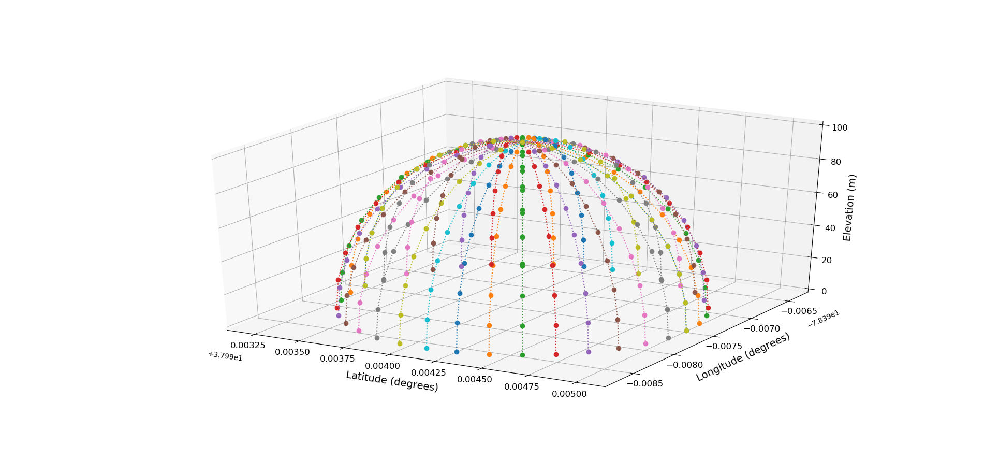

# Flight path generator

The chosen flight path is a series of over-the-horizon sorties to enable a complete hemispherical coverage at fixed radius from the antenna-under-test. Waypoints will be automatically chosen at every 10 degrees step in elevation. Sorties will be spaced 10 degrees in azimuth. For options type:
```
python flight-path-generator.py --help
```
The generated file can be upload directly to the flight controller. Here is an example:
```
python flight-path-generator.py --radius 100 --hold 10 --passes 4
```
This will generate a waypoints file with 4 hemispherical sorties around the default reference point (tarmac on Milton airfield, Charlottesville). A ground control software like QGroundControl can be used to upload this file to the flight controller prior to taking off.

This is what 100 m hemispherical coverage will look like.

