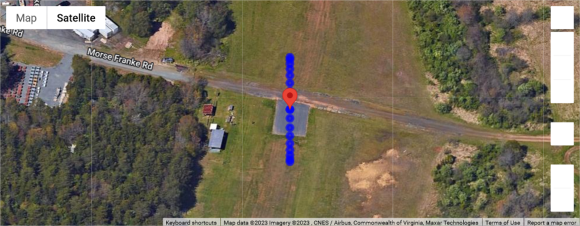

# Flight path generator 🛬

The chosen flight path is a series of over-the-horizon sorties to enable a complete hemispherical coverage at fixed radius from the antenna-under-test. Default angular spacing in elevation is 10 deg. Sorties will be spaced 10 degrees in azimuth. For options type:
```
python flight-path-generator.py --help
```
Here is an example:
```
python flight-path-generator.py -la 37.9941679 -lo -78.3975324 -he 45 -p 1 -f Ardupilot -r 30 
```
To get the drone to follow this mission, run the above command -- or one like it -- on the payload computer. This will generate a `mission.waypoints` file in the `./mission/` folder. Once the drone has been set in `Auto` mode it will initiate its calibration routine at each waypoint in sequence.  

This is what the above mission would look like (use [this](../Analysis/flight_path_plotter.ipynb) tool for visualization):

