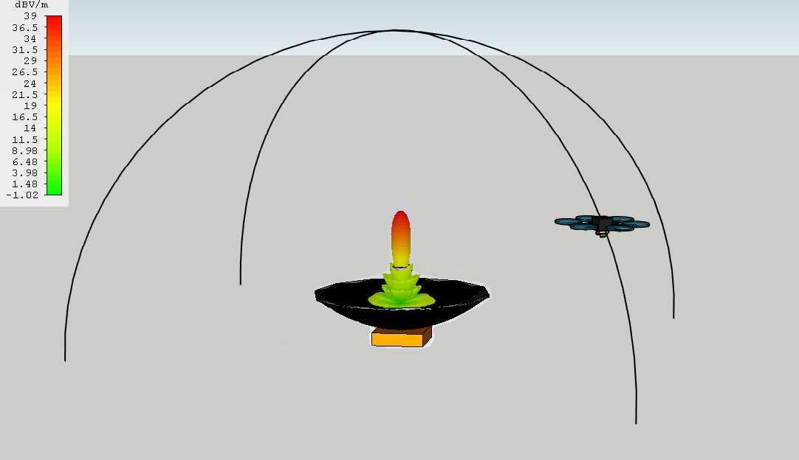
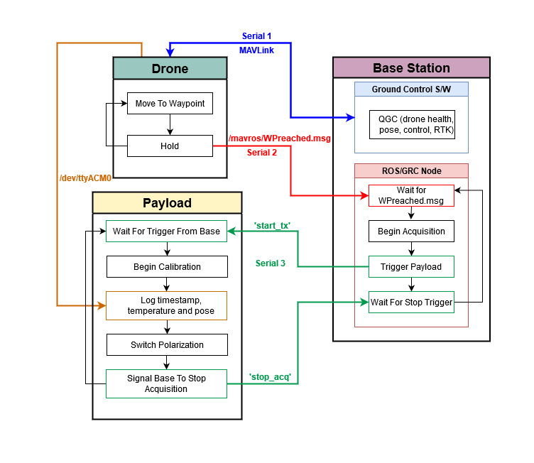

# Drone-Project-code


## Description
A high accuracy drone-based calibrator targeted towards low-frequency radio astronomy instruments. These are codes for the base station, payload computer, and for generating flight paths. More details inside each folder. Clone the repo into a catkin workspace:
```
mkdir /home/$USER/catkin_ws/src/ -p
cd /home/$USER/catkin_ws/src
git clone https://github.com/km5es/Drone-Project-code.git
```

## Dependencies:
ACurrently testing everything using Ubuntu 20.04, ROS Noetic, Python 3.0, GNU Radio 3.8, and UHD 3.15. Here are (some) of the additional dependencies. Follow instructions in the links for more.

### UHD and GNU Radio 
Instructions [here][uhd] and [here][uhd2].
```
sudo apt-get install libboost-all-dev libusb-1.0-0-dev python-mako doxygen python-docutils cmake build-essential
sudo apt-get install libuhd-dev libuhd003 uhd-host
```
As of now, libuhd003 is not found in apt-get's default sources list. Adding the PPA does not seem to make any difference. I have simply ignored that and everything still seems to be copacetic. 


### ROS Noetic + SITL toolchain

#### 1. Start with installing ROS [Noetic][noetic_install]. Follow instructions on that link and then setup catkin workspace and shell sources:
```
mkdir ~/catkin_ws/src/ -p && cd ~/catkin_ws/
catkin_make
```

Then add the following to the ~/.bashrc file:
```
source /opt/ros/noetic/setup.bash
source /home/$USER/catkin_ws/devel/setup.bash
export PYTHONPATH=/usr/lib/python3/dist-packages:/usr/lib/python3/site-packages:$PYTHONPATH
export LD_LIBRARY_PATH=/usr/lib:$LD_LIBRARY_PATH
```

#### 2. PX4 Firmware
Dependencies for building the PX4 firmware are [here][px4_depends]. These are what we need to start off:
```
sudo apt-get install python-argparse \
    python3-empy python3-toml python-numpy python-yaml \
    python-dev python3-pip -y
sudo -H pip3 install --upgrade pip

sudo apt-get install libprotobuf-dev libprotoc-dev protobuf-compiler libeigen3-dev libxml2-utils python3-rospkg python-jinja2 

sudo apt install ros-noetic-mavros
```
These have been tested with an early (August, 2020) build of Ubuntu 20.04. As of now, the Fast-DDS install within the above instructions is broken. Get the full install [here](https://www.eprosima.com/index.php/downloads-all). The tar file is also included in the repository for convenience. 
```
cd ~/catkin_ws/src/Drone-Project-code/
mkdir /home/$USER/Fast-DDS/
tar -xzvf eProsima_Fast-DDS-2.0.0-Linux.tgz -C /home/$USER/Fast-DDS/
cd /home/$USER/Fast-DDS/
chmod +x install.sh
sudo ./install.sh
```

Once MAVROS is installed, it will need geographiclib_datasets:
```
cd ~/catkin_ws/src/Drone-Project-code
chmod +x install_geographiclib_datasets.sh
sudo ./install_geographiclib_datasets.sh
```

Now it's time to build PX4 on your system:
```
cd $HOME
mkdir /src/ && cd ~/src/
git clone https://github.com/PX4/Firmware.git
cd Firmware/
make px4_sitl gazebo_solo
```
Full instructions to be found [here](https://dev.px4.io/v1.9.0/en/setup/building_px4.html). To run in headless mode:
```
HEADLESS=1 make px4_sitl gazebo_solo
```


#### 3. Install QGroundControl. Detailed instructions [here](https://docs.qgroundcontrol.com/en/getting_started/download_and_install.html). Before downloading the app image do this:
```
sudo usermod -a -G dialout $USER
sudo apt-get remove modemmanager -y
sudo apt install gstreamer1.0-plugins-bad gstreamer1.0-libav gstreamer1.0-gl -y
```
Log out and log back in. Then download the app image file from [here](https://s3-us-west-2.amazonaws.com/qgroundcontrol/latest/QGroundControl.AppImage).
```
chmod +x ./QGroundControl.AppImage
./QGroundControl.AppImage  (or double click)
```

#### 4. Build the ROS node:
```
cd /home/$USER/catkin_ws/
catkin_make
```

#### 5. Finally, to set default take-off positions of the drone to Milton airfield add these lines to the bashrc file:
```
export PX4_HOME_LAT=37.994125
export PX4_HOME_LON=-78.397535
export PX4_HOME_ALT=28.5
```
Replace coordinates as necessary.

## Autonomy Pipeline
The codes here enable complete autonomous calibration between the drone (SDR + payload computer) and the ground station (AUT + SDR + base station computer). Here's a flow diagram of the entire process:



Once the PX4 firmware is up and running, this is how one could simulate the entire pipeline using SITL + Gazebo + ROS + GNURadio/UHD.

Terminal 1:
```
cd ~/src/Firmware/
HEADLESS=1 make px4_sitl gazebo_solo
```
Terminal 2:
```
roslaunch mavros px4.launch fcu_url:="udp://:14540@127.0.0.1:14557"
```
Terminal 3:
```
rosrun beam_mapping drone_project.py
```
Terminal 4:
```
python ~/catkin_ws/src/Drone-Project-code/Base\ Station/tcp_toggle.py
```
Terminal 5:
```
python ~/catkin_ws/src/Drone-Project-code/Base\ Station/base-station-receiver.py
```
Run QGroundControl:
```
~/Downloads/QGroundControl.AppImage
```
Enter flight path and begin mission.

>***NOTE:*** The exact sequence shown above needs to be maintained for the simulations to work.

### Run entire SITL autonomy pipeline
```
cd ~/catkin_ws/src/Drone-Project-code/
source sitl-pipeline.sh
```
QGC is not working properly with this shell script as of now. To get the pipeline to run do this in the PX4 terminal:
```
commander mode auto:mission
commander arm
```
This is assuming the flight path is already uploaded to the vehicle. To RTL:
```
commander mode auto:rtl
```
To get it to work with QGC, uncheck the option for auto connecting to SiK radio in the Application Settings > General tab under "AutoConnect to the following devices."

#### TODO:

- [x] Add shell script that performs all of the above.

- [x] Add the GNU Radio codes used for generating the calibration waveforms.

- [x] Add the ROS nodes and mission.csv file/folders as well

- [x] Add install geographiclib shell script

- [x] Add Fast-DDS tar file

- [x] Add mission logs folder from Drone-Nav

- [x] Add instruction to change the home position of the drone to Milton 

- [ ] Add 3D CAD files and RF stuff? 


[uhd]: https://files.ettus.com/manual/page_build_guide.html
[uhd2]: https://files.ettus.com/manual/page_install.html
[noetic_install]: http://wiki.ros.org/noetic/Installation/Ubuntu
[px4_depends]: https://dev.px4.io/v1.9.0/en/setup/dev_env_linux_ubuntu.html